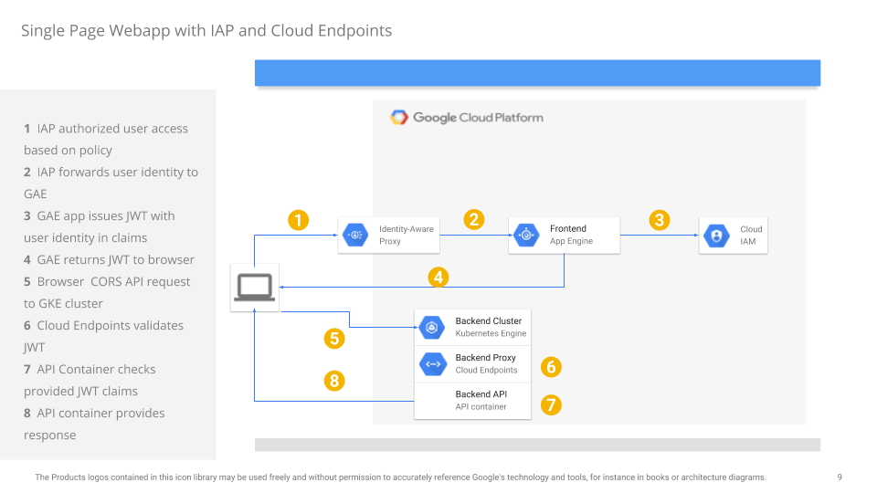
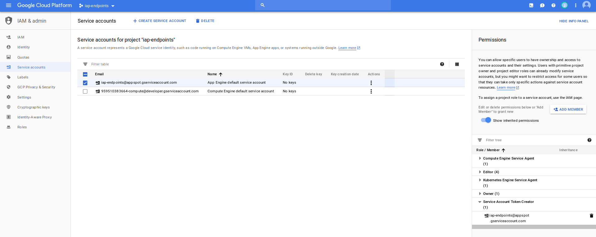
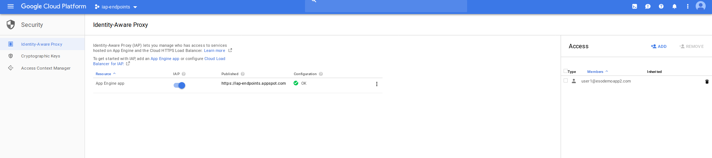
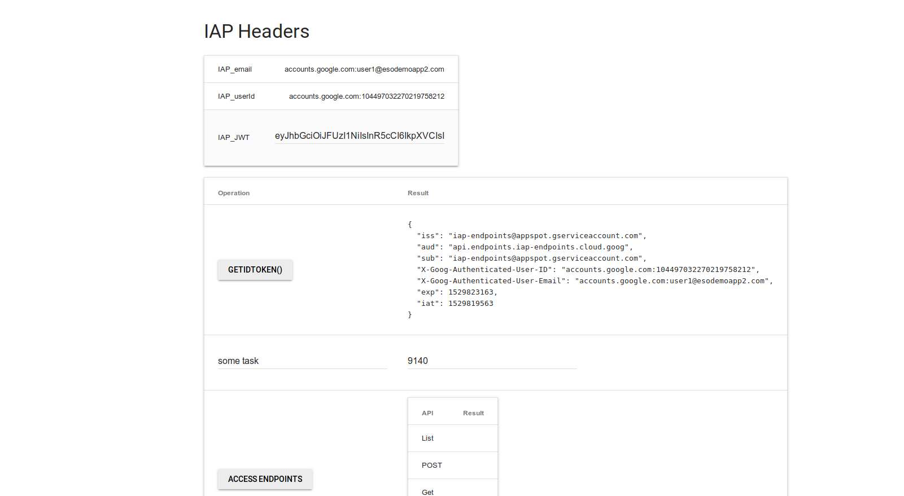
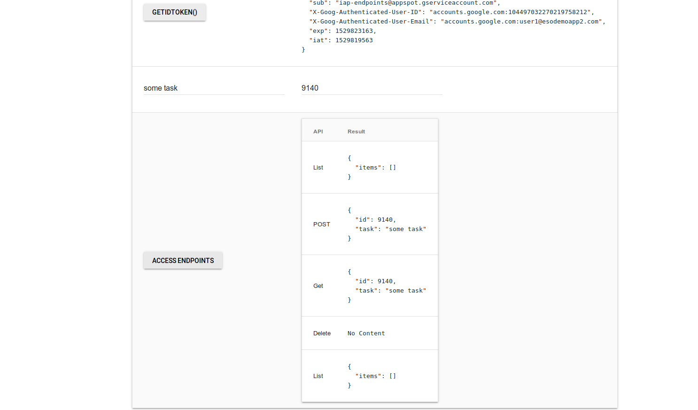

# Single Page webapp using GKE, App Engine, Google Cloud Endpoints and Identity Aware Proxy

## Introduction

This tutorial and repo contains a sample single-page application protected by [Google Cloud Identy-Aware Proxy](https://cloud.google.com/iap/) and a corresponding API service that the appliation accesses behind [Google Cloud Endpoints](https://cloud.google.com/endpoints/).

When used together, your webapp is secured by policy declaration and will only get rendered to authorized users.  Once an authorized user accesses the site, it is given a security token to access an API backend directly from javascript. 

This repo demonstrates several additional features:

* IAP
  - How to reissue a JWT identity token from App Engine Standard
  - Adding specific claims/constraints to JWT token based in IAP identities provided.

* Endpoints
  - Cloud Endpoints ability to dynamically provision DNS entries under ```cloud.goog``` domain per project
  - Using ```Let's Encrypt``` to issue a certificate for a GKE ```Ingresss``` object
  - CORS support for Cloud Endpoints


  

This is a fairly long tutorial with several steps which must be performed in sequence.

### Limitations

- Access to your Endpoints API using the reissued IAP token is not constrained by any IAM conditions applied to IAP.
  What that means is the while you maybe able to apply IAM conditions such as time of day, sourceIP and other polcies to a users IAP access, the JWT token reissued by IAP will not carry those conditions along inherently.  The endpoints applcation will need to validate/check for any embedded claims the JWT carries as policy or (preferably), perform a policy lookup to compare.

- At the time of writing (6/25/18), App Engine Standard does not fully support WebSockets or gRPC inbound. If you require those technologies against your frontend application, consider using IAP with GKE and setting  ```type: Loadbalancer``` as the service.

---

## Prerequsites

 - Create a GCP project and enable Billing

In the example below, we will interchangeably use ```iap-endpoints``` as the project holding GKE and IAP
```
   gcloud config set project iap-endpoints
   gcloud services enable iam.googleapis.com compute.googleapis.com container.googleapis.com containerregistry.googleapis.com appengine.googleapis.com
```

---

## IAP

The following steps sets up the IAP application running on ```Google App Engine Standard```

1) Configure IAP environment

  First step is to configure and deploy IAP

```
   cd iap

   virtualenv env
   source env/bin/activate
   pip install -r requirements.txt -t lib
   deactivate
   rm -rf env
```


2) Update IAP javascript with endpoint

  - Edit ```iap/public/iap.js``` set ```baseUrl=``` with your projectID  for endpoints

```javascript
    var baseUrl= 'https://api.endpoints.YOUR_PROJECT_ID.cloud.goog';
```

  - Edit ```main.py``` and set the audience field to  your project
  ```
    audience = 'api.endpoints.YOUR-PROJECT.cloud.goog'
  ```
 

3) Deploy IAP application

  When prompted, pick any region (eg ```us-central1```)

```
   gcloud app deploy app.yaml --version iap
```


4) Add IAM role to create signed JWT to service_account

  - Navigate to ```IAM & Admin >> Service Accounts```
  - Find the service account for GAE (should be something like ```iap-endpoints@appspot.gserviceaccount.com```)
  - Add ```Service Account Token Creator``` role to itself:

  


5) Enable IAP and add user/group access

  - Navigate to ```Security >> Identity Aware Proxy```
  - Configure Consent screen and Enable IAP
  - Add a user to IAP allowed list (in the case below, ```user1@esodemoapp2.com```)

  


6) Verify IAP access and token generation
  
  - Open an incognito winddow and navigate to   ```https://your_project.appspot.com```
  - Login as the user specified for IAP access
  - Click on ```getToken()``` button (do not click on any other one)

  You should a newly minted JWT with claims identifying the user:

  

  Note: you can also access [IAP Programatically](https://cloud.google.com/iap/docs/authentication-howto#authenticating_from_a_service_account)

---

## Endpoints


### Configure Endpoints

```
  cd endpoints/http
```

7) Allocate Static IP

   ```
   gcloud compute addresses create esp-ip --global
   ```

   For example:
   ```
   $ gcloud compute addresses list
     NAME    REGION  ADDRESS        STATUS
     esp-ip          35.201.95.158  RESERVED
   ```

8) Edit ```openapi.yaml``` and specify IAP access credentials, static IP
   - Replace ```YOUR-PROJECT``` and ```STATIC-IP``` values.  
   - Keep  make sure```x-google-allow: all``` is set.  (see [google openapi-extensions](https://cloud.google.com/endpoints/docs/openapi/openapi-extensions))
   
   For example,


    ```
    swagger: '2.0'
    host: api.endpoints.iap-endpoints.cloud.goog
    x-google-endpoints:
    - name: api.endpoints.iap-endpoints.cloud.goog
      allowCors: true
      target: 35.201.95.158
    x-google-allow: all
    ...
    ...
    securityDefinitions:
      google_service_account:
        authorizationUrl: ""
        flow: "implicit"
        type: "oauth2"
        x-google-issuer: "iap-endpoints@appspot.gserviceaccount.com"
        x-google-jwks_uri: "https://www.googleapis.com/robot/v1/metadata/x509/iap-endpoints@appspot.gserviceaccount.com"
        x-google-audiences: "api.endpoints.iap-endpoints.cloud.goog"
    ```

9) Deploy endpoints specification

```
   gcloud endpoints services deploy openapi.yaml
```

  Once deployed, you should see the configurations listed:
  ```
  $ gcloud endpoints services list
  NAME                                    TITLE
  api.endpoints.iap-endpoints.cloud.goog  TodoMVC API
  ```

10) Wait for DNS entry to get created for endpoints service
   This may take ~5mins but you should see 
```
   nslookup api.endpoints.YOUR-PROJECT.cloud.goog
```
  as in:
```
   $ nslookup api.endpoints.iap-endpoints.cloud.goog
      Server:		127.0.0.1
      Address:	127.0.0.1#53

      Non-authoritative answer:
      Name:	api.endpoints.iap-endpoints.cloud.goog
      Address: 35.201.95.158
```  


11) Create and push API server container

   As above, replace ```YOUR-PROJECT```, as in

```  
   docker build -t gcr.io/YOUR-PROJECT/myapp .
   gcloud docker -- push gcr.io/YOUR-PROJECT/myapp
```   

```  
   docker build -t gcr.io/iap-endpoints/myapp .
   gcloud docker -- push gcr.io/iap-endpoints/myapp
```

### Create GKE Cluster

```
   cd endpoints/gke
```

12) Create a GKE cluster

```
   gcloud container  clusters create cluster-1 --zone us-central1-a  --num-nodes 1
```


### Configure API server for LetsEncrypt

13) Edit ```configmap.yaml```, ```ingress.yaml```,  and update setting for ```YOUR-PROJECT```

```yaml
    apiVersion: v1
    kind: ConfigMap
    metadata:
      name: env-var
      labels:
        type: endpoints-app  
    data:
      IAP_URL: "https://YOUR-PROJECT.appspot.com"
      JWT_ISSUER: "YOUR-PROJECT@appspot.gserviceaccount.com"
      JWT_AUDIENCE: "api.endpoints.YOUR-PROJECT.cloud.goog"
```

as in

```yaml
    apiVersion: v1
    kind: ConfigMap
    metadata:
      name: env-var
      labels:
        type: endpoints-app  
    data:
      IAP_URL: "https://iap-endpoints.appspot.com"
      JWT_ISSUER: "iap-endpoints@appspot.gserviceaccount.com"
      JWT_AUDIENCE: "api.endpoints.iap-endpoints.cloud.goog"
```

   Edit ```ingress.yaml```, make sure
   ```kubernetes.io/ingress.allowHTTP: "false"``` is commented
   ```host:``` specifies the project you're using, eg

```yaml
    apiVersion: extensions/v1beta1
    kind: Ingress
    metadata:
      name: esp-ingress
      annotations:
        kubernetes.io/ingress.global-static-ip-name: esp-ip
        #kubernetes.io/ingress.allow-http: "false"
      labels:
        type: endpoints-app
    spec:
      tls:
      - secretName: esp-tls  
      rules:
      - host: api.endpoints.iap-project.cloud.goog
        http:
          paths:
          - path: /*
            backend:
              serviceName: esp-srv
              servicePort: 80
```

   Edit ```deployment.yaml``` and specify the image you uploaded previosly
   ```yaml
     - name: myapp
       image: gcr.io/iap-endpoints/myapp
   ```


  - Provisioning a new LoadBalancer can take upto 10minutes,
  - Make sure your app is fully deployed:

```
      $ kubectl get deployments,po,svc,ingress,secrets
      NAME                    DESIRED   CURRENT   UP-TO-DATE   AVAILABLE   AGE
      deploy/esp-deployment   1         1         1            1           4m

      NAME                                 READY     STATUS    RESTARTS   AGE
      po/esp-deployment-6d97cb98c6-mrzdz   2/2       Running   0          4m

      NAME             TYPE        CLUSTER-IP      EXTERNAL-IP   PORT(S)        AGE
      svc/esp-srv      NodePort    10.11.245.180   <none>        80:30059/TCP   4m
      svc/kubernetes   ClusterIP   10.11.240.1     <none>        443/TCP        15m

      NAME              HOSTS                                    ADDRESS         PORTS     AGE
      ing/esp-ingress   api.endpoints.iap-endpoints.cloud.goog   35.201.95.158   80, 443   4m

      NAME                          TYPE                                  DATA      AGE
      secrets/default-token-cqhln   kubernetes.io/service-account-token   3         15m
```  

   Again, wait 10minutes, you should see your app here:
   - http://api.endpoints.iap-endpoints.cloud.goog/swagger.json
     >> NOTE, its ```http://``` since we haven't configure LetEncrypt fully yet

### Configure LetsEncrypt

  The following instructions to use ```LetsEncrypt``` with GKE is taken in part from [https://github.com/ahmetb/gke-letsencrypt](https://github.com/ahmetb/gke-letsencrypt).

14) Download and install Helm
   
```
      wget https://storage.googleapis.com/kubernetes-helm/helm-v2.9.1-linux-amd64.tar.gz
      tar xzvf helm-v2.9.1-linux-amd64.tar.gz && rm helm-v2.9.1-linux-amd64.tar.gz && export PATH=$PATH:`pwd`/linux-amd64
``` 

```     
     kubectl create serviceaccount -n kube-system tiller

     kubectl create clusterrolebinding tiller-binding --clusterrole=cluster-admin --serviceaccount kube-system:tiller
 
     helm init --service-account tiller
```

   wait maybe 30->40s, then

15) Install ```cert-manager```

```
     helm install --name cert-manager --version v0.3.1 --namespace kube-system stable/cert-manager
```

```
     export EMAIL=yourname@your-email.com

     cat letsencrypt-issuer.yaml | sed -e "s/email: ''/email: $EMAIL/g" | kubectl apply -f-
```

16) Verify server availablity over DNS and http

    Make sure the server is available at: http://api.endpoints.endpoints-project-203611.cloud.goog/


17) Edit LetsEncrypt certificates:

    - Edit ```certificate.yaml``` and specify ```YOUR-PROJECT``` as in:

    ```yaml
      apiVersion: certmanager.k8s.io/v1alpha1
      kind: Certificate
      metadata:
        name: esp-tls
        namespace: default
      spec:
        secretName: esp-tls
        issuerRef:
          name: letsencrypt-prod
          kind: ClusterIssuer
        commonName: api.endpoints.iap-endpoints.cloud.goog
        dnsNames:
        - api.endpoints.iap-endpoints.cloud.goog
        acme:
          config:
          - http01:
              ingress: esp-ingress
            domains:
            - api.endpoints.iap-endpoints.cloud.goog
    ```

    then
    ```
      kubectl apply -f certificate.yaml
    ```

    Once you applied for a LetsEncrypt certificate, keep running the describe command below to check updates
    This step may take 5->7mins

    ```
      kubectl describe -f certificate.yaml
    ```

    Once everything is done, you should see:

```
    $ kubectl describe -f certificate.yaml

      Name:         esp-tls
      Namespace:    default
      ...
      Spec:
        Acme:
          Config:
            Domains:
              api.endpoints.iap-endpoints.cloud.goog
            Http 01:
              Ingress:  esp-ingress
        Common Name:    api.endpoints.iap-endpoints.cloud.goog
        Dns Names:
          api.endpoints.iap-endpoints.cloud.goog
        Issuer Ref:
          Kind:       ClusterIssuer
          Name:       letsencrypt-prod
        Secret Name:  esp-tls
        ...
        Conditions:
          Last Transition Time:  2018-06-24T05:31:11Z
          Message:               Certificate issued successfully
          Reason:                CertIssued
          Status:                True
          Type:                  Ready
          Last Transition Time:  <nil>
          Message:               Order validated
          Reason:                OrderValidated
          Status:                False
          Type:                  ValidateFailed
      Events:
        Type    Reason          Age   From          Message
        ----    ------          ----  ----          -------
        Normal  CreateOrder     6m    cert-manager  Created new ACME order, attempting validation...
        Normal  DomainVerified  7s    cert-manager  Domain "api.endpoints.iap-endpoints.cloud.goog" verified with "http-01" validation
        Normal  IssueCert       6s    cert-manager  Issuing certificate...
        Normal  CertObtained    5s    cert-manager  Obtained certificate from ACME server
        Normal  CertIssued      5s    cert-manager  Certificate issued successfully
```
    
    You can also verify by checking if ```esp-tls``` secret has been provisioned

```
            $ kubectl get secrets
              NAME                  TYPE                                  DATA      AGE
              default-token-cqhln   kubernetes.io/service-account-token   3         29m
              esp-tls               kubernetes.io/tls                     2         1m
```

   Ok, now we've finally got our cert!


### Reconfigure API server Ingress for HTTPS

  18)  Reconfigure the deployment for security:

   - Edit ```openapi.yaml```

     ```
     x-google-allow: configured
     ```

  Deploy Application 
  
  ```
  gcloud endpoints services deploy openapi.yaml
  ```

  Once the application is deployed, add the cert in now for the ingress oject

  13) Reconfigure Ingress for SSL

  Edit ```ingress.yaml```, uncomment and disable http:

  ```
    metadata:
      annotations:
        ...
        kubernetes.io/ingress.allow-http: "false"
    ...
    spec:
      tls:
      - secretName: esp-tls
   ```

  Apply

    ```
      kubectl apply -f ingress.yaml
    ```

  19) Verify application is available over https:

      Again, this may take a couple of minutes

      - Verify ```swagger``` is available without security
          https://api.endpoints.iap-endpoints.cloud.goog/swagger.json
      - Verify ```/todos``` endpoint requires security
          https://api.endpoints.iap-endpoints.cloud.goog/todos
     


## End to End test

20) Open up the IAP application again (eg)
   - http://iap-endpoints.appspot.com
   - Click ```getToken()```
   - Click ```Access Endpoints```

   You should see the CRUD api calls as shown below

   


What that page is demonstrating is a single page application rendered by IAP that is making authenticated API calls to cloud endpoints.

## Conclustion

This sample application shows how to use two Google Cloud products together to achieve a common usecase:  policy based webapp access and its secure access to an API endpoint.  While there are some limitations with this teqnique as described above, this pattern should let you develop appication and control access to its consitutent APIs it calls.  In a future updates, we will demonstrate using ```gRPC``` api calls to your API backend instead of the current ```REST```.  We will also show how to embed additional claims and authorization extensions for Endpoints and IAM.

## Appendix


### TEST Endpoints with IAP token

You can test the API server after it is deployed by getting a token for IAP using ```getToken()``` call and then submitting that in the curl request:

```
        cd token_app
        virtualenv env
        source env/bin/activate
        pip install -r requirements.txt

        python main.py
        export AZ={Jwt_token}

        $ curl -k -H "Authorization: Bearer $AZ" https://api.endpoints.YOUR-PROJECT.cloud.goog/todos
        {
            "items": []
        }
```


### Run ESP Locally

There are several ways to test the API server:

 - Standalone:  run the endpoints ```http_server.py``` directly.
   This will bypass ESP authentication checks and you will also need to bypass the basic validation done in code

 - Start ESP server locally and also run ```http_server.py``` with security checks enabled.
   - If ESP is setup with default checks for an id_token issued by IAP, access the IAP main page and invoke ```getToken()``` to get a token to use.
     Place this token in the ```Authorizaiton: Bearer ``` header value of any API call.
 
  - Update ```openapi.yaml``` file and specify a service account as an issuer.   You will need to download a service account json file and place it within the ```certs``` folder (```certs/svc_account.json```).  Once its downloaded, change the seurity definitions to use it:
      ```yaml
          securityDefinitions:
            google_service_account:
              authorizationUrl: ""
              flow: "implicit"
              type: "oauth2"
              x-google-issuer: "YOUR_SERVICE_ACCOUNT@gserviceaccount.com"
              x-google-jwks_uri: "https://www.googleapis.com/robot/v1/metadata/x509/YOUR_SERVICE_ACCOUNT@appspot.gserviceaccount.com"
              x-google-audiences: "api.endpoints.YOUR_PROJECT.cloud.goog"  
      ```

     - then upload  the config:
    ```
      $ gcloud endpoints services deploy openapi.yaml
    ```
     
  - Start the backend service to listen on ```:50051```

    ```
        cd http
        virtualenv env 
        source env/bin/activate
        pip install -r requirements.txt

        python http_server.py
    ```
  - Start ESP and specify the service name and configuration ```version``` (in this case ```2018-06-24r1```)

      ```
      $ gcloud endpoints services describe api.endpoints.iap-endpoints.cloud.goog
      generation: '2'
      producerProjectId: iap-endpoints
      serviceConfig:
        documentation:
          summary: A simple TodoMVC API
        id: 2018-06-24r1
     ``` 

  - Start ESP in docker

    - You need to first download a service_account JSON cert file from the google cloud console
      On the cloud console, navigate to ```IAM & Admin >> Service Accounts```,  create a new service account with a json certificate file.
      Set an IAM permission on that service account:  ```Service Managemernt >> Servcie Controller```.

    - Note ```version``` field provided by the endpoint you just deployed.  In this example, its ```2018-06-24r1```

    - Start ESP

      ```
      docker run   \
          -t  \
          --net="host"  \
          --volume `pwd`/certs/:/esp  \
          gcr.io/endpoints-release/endpoints-runtime:1  \
          --service  api.endpoints.YOUR-PROJECT.cloud.goog  \
          --version  2018-06-24r1  \
          --http_port  8080  \
          --backend 127.0.0.1:50051  \
          --service_account_key /esp/svc_account.json
      ```

    - For more information, see
      - - [https://github.com/salrashid123/esp_docker](https://github.com/salrashid123/esp_docker)


### CORS

Since we are running a javascript browser application, any API call from the browser to Cloud Endpoints must work with  CORS.  The following describes a sample CORS request and response headers it supports:

- Several things to note:
  - certificate ```issuer:``` is ```Lets Encrypt```
  - DNS resolution for ```api.endpoints.iap-endpoints.cloud.goog``` points to the static IP address we set earlier ```35.201.95.158```

```
$ curl -v -k -H "Origin: https://iap-endpoints.appspot.com"   -H "Access-Control-Request-Method: GET"   -H "Access-Control-Request-Headers: Authorization, X-My-Custom-Header"   -X OPTIONS  https://api.endpoints.iap-endpoints.cloud.goog/todos

*   Trying 35.201.95.158...
* Connected to api.endpoints.iap-endpoints.cloud.goog (35.201.95.158) port 443 (#0)

* Server certificate:
*  subject: CN=api.endpoints.iap-endpoints.cloud.goog
*  start date: Jun 24 04:31:10 2018 GMT
*  expire date: Sep 22 04:31:10 2018 GMT
*  issuer: C=US; O=Let's Encrypt; CN=Let's Encrypt Authority X3
*  SSL certificate verify ok.

> OPTIONS /todos HTTP/2
> Host: api.endpoints.iap-endpoints.cloud.goog
> User-Agent: curl/7.58.0
> Accept: */*
> Origin: https://iap-endpoints.appspot.com
> Access-Control-Request-Method: GET
> Access-Control-Request-Headers: Authorization, X-My-Custom-Header


< HTTP/2 200 
< server: nginx
< date: Sun, 24 Jun 2018 05:44:00 GMT
< content-type: text/html; charset=utf-8
< content-length: 0
< allow: HEAD, GET, POST, OPTIONS
< access-control-allow-origin: https://iap-endpoints.appspot.com
< access-control-allow-headers: Authorization, X-My-Custom-Header
< access-control-allow-methods: DELETE, GET, POST, PUT
< via: 1.1 google
< alt-svc: clear
```


### gRPC

The endpoints server here uses REST over HTTP.  You can also configure ```gRPC``` for the endpoint API sever.
However, a couple of notes:

- At the time of writing (6/23/18), GKE Ingress services does not support gRPC so a Network (L4 ```type: Loadbalancer```) needs to be used
- You may need to terminate SSL on the Pod where the ESP is running

- References to running gRPC:

- [https://github.com/salrashid123/esp_docker](https://github.com/salrashid123/esp_docker)
- [https://github.com/grpc/grpc-web](https://github.com/grpc/grpc-web)

## References

- [Extend GCP Service Account Identity and Token Scope on AppEngine and Cloud Functions](https://medium.com/google-cloud/extend-gcp-service-account-identity-and-token-scope-on-appengine-and-cloud-functions-f69716f965d1)

- [Using serviceAccountActor IAM role for account impersonation on Google Cloud Platform](https://medium.com/google-cloud/using-serviceaccountactor-iam-role-for-account-impersonation-on-google-cloud-platform-a9e7118480ed)